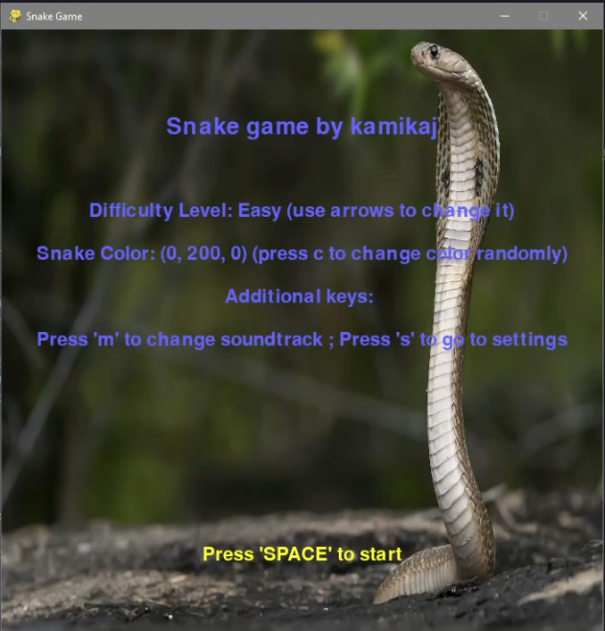
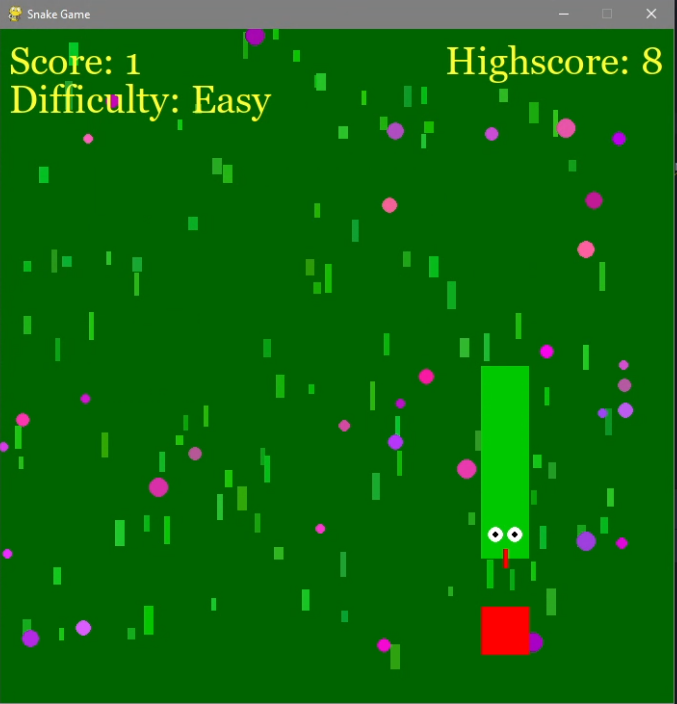

#  Snake  
  
Prosta gra klasyczna typu snake, napisana w Pythonie (z użyciem biblioteki Pygame).  
Projekt stworzony w celach edukacyjnych.  
Gra posiada system punktacji oraz zapis najlepszego wyniku.  

  
  Struktura projektu:  
Tetris/  
│  
├── game.py (kod gry)  
├── resources/  
│   ├── data/  
│   │    ├── highscore.json (plik przechowujący najwyższy dotychczasowy wynik)  
│   ├── score/  
│   ├── screen/ (folder na tło gry)  
│   └── music/ (folder z muzyką)  
│  
└── README.md  
  
Autor: kamikaj
