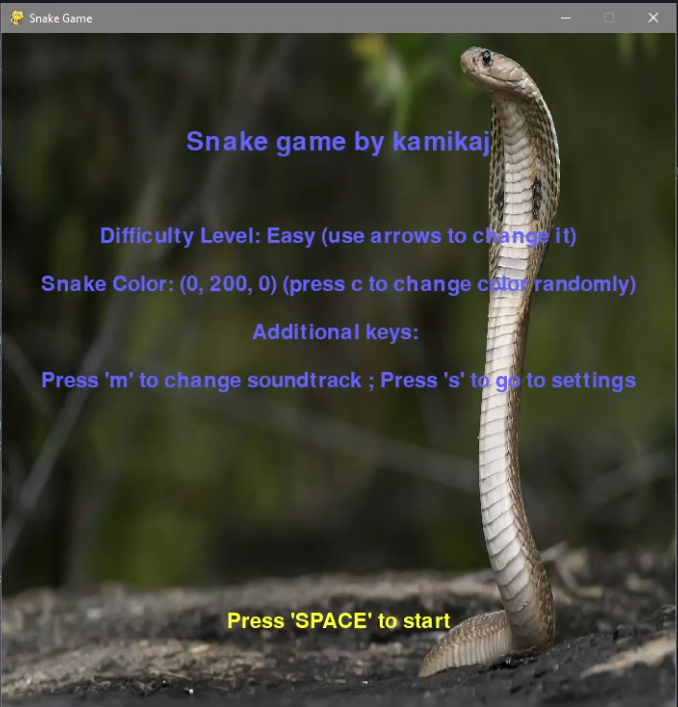
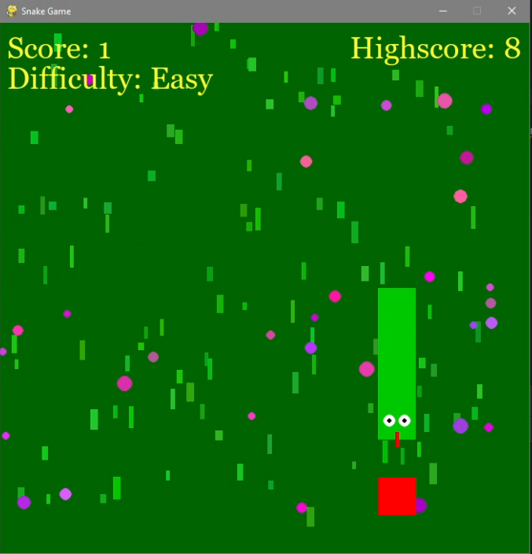

# Snake

A simple implementation of the classic **Snake** game, built with Python and the **Pygame** library.

This project was developed for educational purposes to practice game development concepts. It features a scoring system and persistent high-score tracking to keep the gameplay engaging.

## Screenshots





---

## Project Structure

The project is structured as follows:

```text
Snake/
│
├── game.py            # Main game logic and loop
├── resources/
│   ├── data/
│   │   └── highscore.json  # Stores the all-time high score
│   ├── score/         # Assets related to scoring display
│   ├── screen/        # Background images and UI screens
│   └── music/         # Background music and sound effects
└── README.md
```
Author: kamikaj
